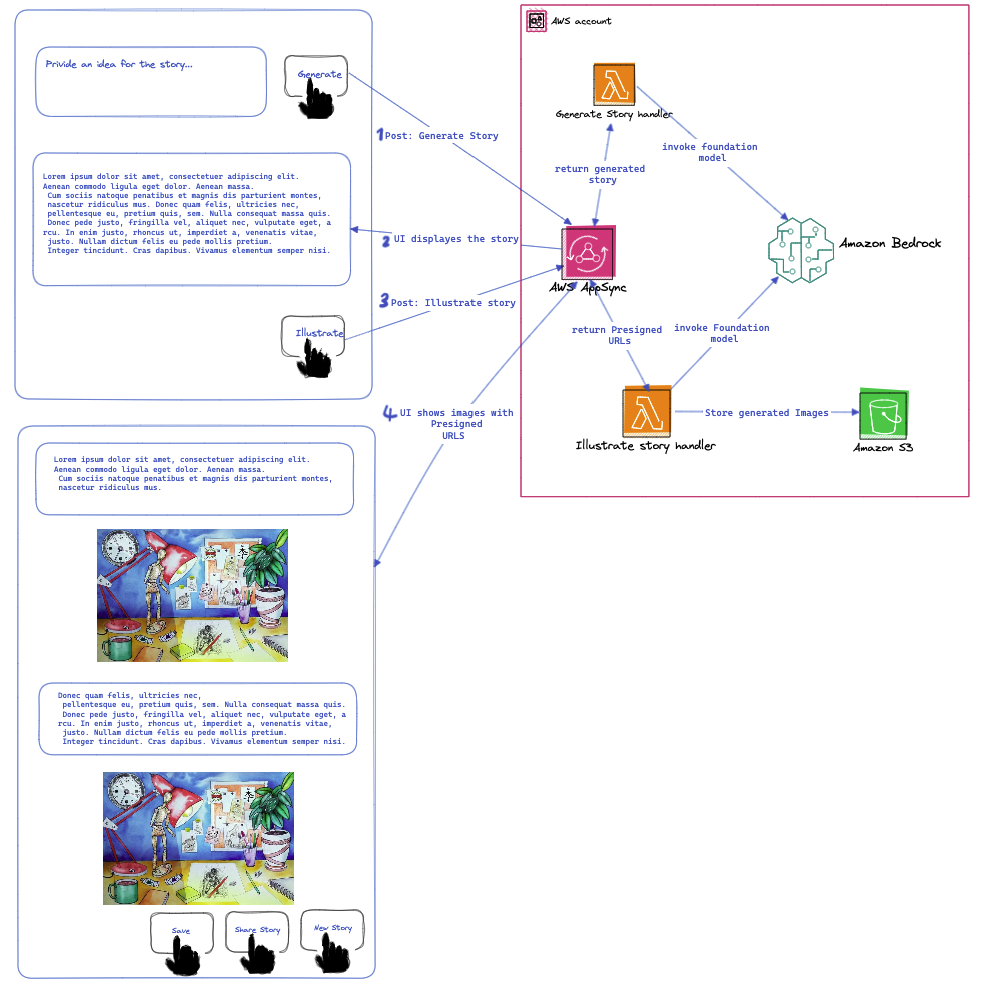

# Story Teller

**Story Teller** is a full-stack NodeJs GenAI application that leverages the power of Amazon Bedrock, AWS AppSync, GraphQL for the backend, and React with Next.js for the frontend. It provides a simple yet efficient platform for creating stories. Whether you're a parent, tech specialist, or simply want to explore with Amazon Bedrock, Story Teller makes it easy for you.

**Note: This project is related to my [blog posts serries]() on Amazon Bedrock Basics. You can find more in-depth explanations and tutorials on my blog.**

## Solution Architect

## Features
- **Create Stories:** Craft rich, interactive stories with Amazon Bedrock Basic Models.
- **Illustrate Stories:** Illustrates the story with images using Amazon Bedrock Basic Models.

## Table of Contents

- [Getting Started](#getting-started)
- [Backend Setup](#backend-setup)
- [Frontend Setup](#frontend-setup)
- [Usage](#usage)
- [Contributing](#contributing)
- [License](#license)

## Getting Started

Follow these instructions to get the Story Teller project up and running on your local machine.

### Backend Setup

1. **Install dependencies:** `npm install`.
2. **AWS CLI:** Setup and configure your AWS CLI.
3. **Deploy Serverless Stack:** `npm run deploy`

### Frontend Setup

1. **Install dependencies:** `npm install`.
2. **Run Web Application locally:** `npm run dev`.

## Usage

After the setup, you can start using Story Teller:

1. **Craft Stories:** Use the user-friendly interface to create interactive narratives.
2. **Generate Illustrations:** Share your stories with the community, comment on others' work, and explore the world of storytelling.

## More Features To Add

- **User Experience:** To stream the generated stories for smoother user experience.
- **Model Accuracy:** Fine tune the basic models so that get more accurate stories and realistic images.
- **User Authentication/User Profile:** Secure user registration and authentication to manage their stories and engage with the community.
- **Update/Delete Stories:** So that user can Modify/Delete their stories.
- **Store Stories:** The user should be able to store their generated and polished stories under their profile.
- **Share/Export Stories:** The user should be able to export/share their generated stories under their profile.
- **Filter stories within an Account:** Users should be able to search for a given story within their account.
- **Filter && Search stories Globally:** Discover an list of stories shared by the community and connect with fellow storytellers.
- **Add Audio:** Simply by using Amazon Polly, add audio to the generated story.
- **Comment & Share:** Engage with stories through comments and share your favorite narratives.
- **UI Design:** Customise/improve the application design.

## Contributing

We welcome contributions to make Story Teller better. To contribute, follow these steps:

1. Fork the repository.
2. Create a new branch for your feature or bug fix.
3. Make your changes.
4. Test your changes to ensure they work as expected.
5. Submit a pull request with a clear description of your changes.

## License

This project is licensed under the MIT License - see the [LICENSE](LICENSE) file for details.
